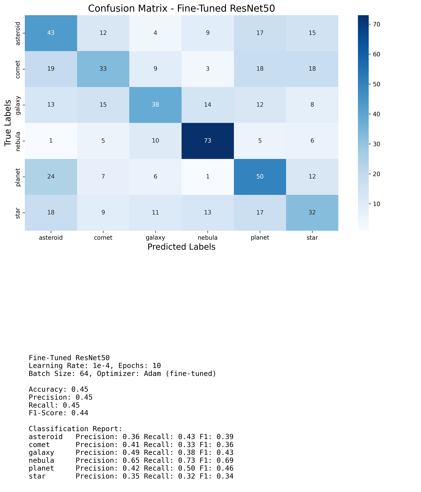
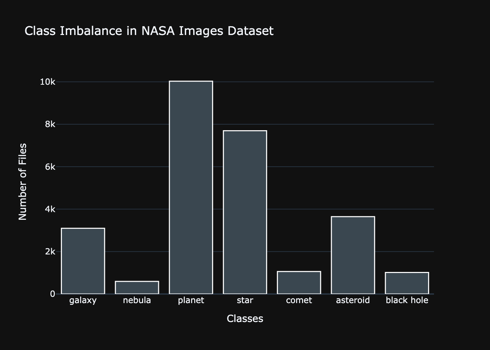
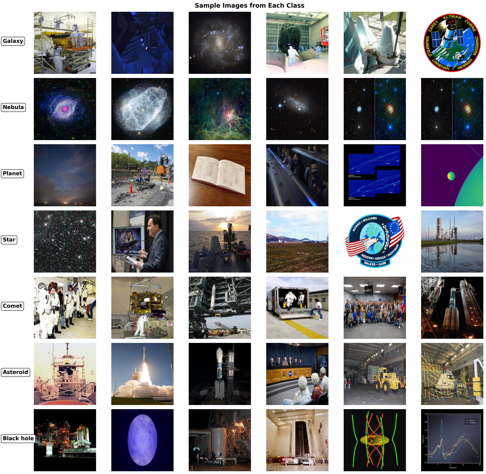

# **Cosmic Morphology**

  
   
  <small><em>Hubble Beholds a Big, Beautiful Blue Galaxy NGC 2336, captured by the NASA/ESA Hubble Space Telescope.</em></small>

## **Overview**
This **project** focuses on building a scalable data infrastructure to store and analyze real cosmic data retrieved from the NASA API. The primary goal is to develop a robust **multiclass classification model** capable of identifying various celestial phenomena, such as galaxies, nebulae, and stars.

## Objectives
- **Scalable Infraestructure:** Create a system for retrieving, storing and processing image data from APIs.
- **Classify Cosmic Morphology:** Multiclass classification model to identify 6 classes; asteroid, comet, galaxy, nebula, planet, star.
- **Enhance System Performance:** Further model fine-tuning, 
  
## **📂 Methods**

- **`1-Data-Collection`**: Scripts for data extraction from NASA API, fetching cosmic images.
- **`2-EDA`**: Notebooks and scripts for Exploratory Data Analysis (EDA), including class imbalance visualizations.
- **`3-Train-Val-Test-Split`**: Code for splitting data into training, validation, and test sets for model training.
- **`4-Machine-Learning`**: Contains:
  - **Baseline Model**: Initial ResNet50-based training and evaluation.
  - **Fine-Tuning**: Transfer learning with additional layers and parameters.
  - **Evaluation**: Metrics visualizations and model performance analysis.

## **Results**

    

    

    

## **Conclusions**

  - The fine-tuned model showed modest improvements in precision and recall for certain classes, notably "nebula" and "galaxy".
  - Class imbalances and noisy data remain significant challenges affecting overall performance.

**Next Steps**
   - Clean and refine image data to remove mislabeled or irrelevant samples.
  - Try out other transfer learning models and pre-trained weights.
  - Expand the dataset by incorporating the [SpaceNet dataset](https://www.kaggle.com/datasets/razaimam45/spacenet-an-optimally-distributed-astronomy-data) and evaluate the impact of synthetic data augmentation on model generalization.

## **Bibliography**
- Lintott, C. J. et al. (2008). Galaxy Zoo: Morphologies derived from visual inspection of galaxies from the Sloan Digital Sky Survey. *Monthly Notices of the Royal Astronomical Society*, 389(3), 1179–1189.
- Willett, K. W. et al. (2013). Galaxy Zoo 2: Detailed morphological classifications for 304,122 galaxies from the Sloan Digital Sky Survey. *Monthly Notices of the Royal Astronomical Society*, 435(3), 2835–2860.
- Chollet, F. (n.d.). Image Classification from Scratch. *Keras*. Retrieved from [https://keras.io/examples/vision/image_classification_from_scratch/](https://keras.io/examples/vision/image_classification_from_scratch/)
- Chollet, F. (n.d.). Keras Metrics. *Keras*. Retrieved from [https://keras.io/api/metrics/](https://keras.io/api/metrics/)
- Nicholas Renotte. (n.d.). Build a Deep CNN Image Classifier with ANY Images. *YouTube*. Retrieved from [https://www.youtube.com](https://www.youtube.com)*